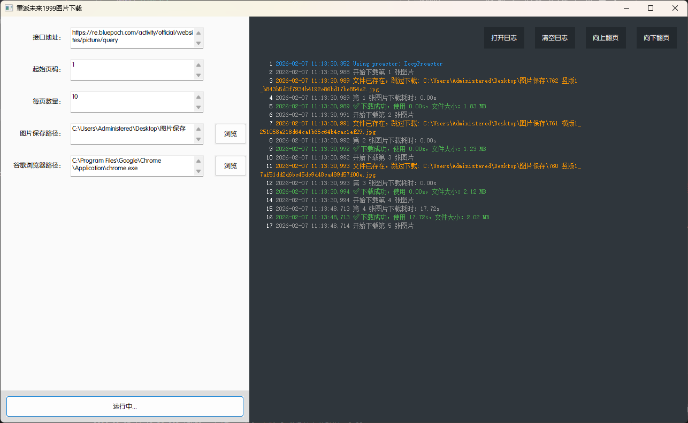

# 项目说明
1. 虽然我不玩《重返未来1999》，但是我很喜欢它的美术
2. 图片来源地址 https://re.bluepoch.com/home/detail.html#wallpaper
3. 会根据起始页码和每页数量，来循环请求接口，获取所有图片的url
4. 会跳过已经下载过的图片，避免重复下载
5. 没有写停止下载的功能，我懒，直接关闭软件就好
6. 代码全部来源于ChatGPT和Trae

# 技术说明
1. 项目基于 Python 开发
2. 项目依赖的第三方库请参考 requirements.txt 文件
3. 本来以为直接requests就可以了，然后发现它做了防盗链，就不得不用playwright来模拟浏览器请求

# 使用说明
1. 接口地址：https://re.bluepoch.com/activity/official/websites/picture/query
2. 起始页码：1
    - 只要是大于0的数字，都可以，但是太大了可能没有那么多图片
3. 每页数量：10
    - 官方的接口填的是15，大家随意吧，是数字就行
4. 图片保存路径
    - 你自己指定一个文件夹
5. 谷歌浏览器路径
    - 你需要自己安装一个谷歌浏览器
    - 填写它的安装路径
    - 比如 C:\Program Files\Google\Chrome\Application\chrome.exe
    - 不能用Edge，会报错
    - 本来我是一起打包进去的，但是打包出来的软件体积太大了，接近300M，遂放弃
5. 运行软件后会在同目录生成logs文件夹，里面会有运行日志
6. 同目录下会有一个同名的cfg配置文件
    - 里面会存储你之前填写的参数
    - 下次运行软件时，会自动读取这个配置文件

# 源码运行说明
1. 安装python
2. 安装依赖库
    - pip install -r requirements.txt
3. 运行软件
    - python Reverse_1999_image_download.py
4. 打包软件
    - pyinstaller Reverse_1999_image_download.spec
    - 打包出来的软件在dist文件夹下

# 软件截图
